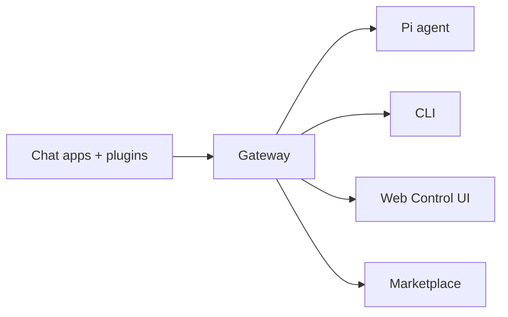

# SimpleClaw

<p align="center">
  <strong>Private AI gateway with WebSocket and chat completions support, multi-channel messaging, and a curated skill marketplace.</strong><br />
  Run a single Gateway process on your own infrastructure and connect AI agents to your messaging apps.
</p>

<Columns>
  <Card title="Get Started" href="/start/getting-started" icon="rocket">
    Install SimpleClaw and bring up the Gateway in minutes.
  </Card>
  <Card title="Run the Wizard" href="/start/wizard" icon="sparkles">
    Guided setup with `simpleclaw onboard` and pairing flows.
  </Card>
  <Card title="Marketplace" href="/tools/marketplace" icon="store">
    Browse and install skills from the private marketplace.
  </Card>
</Columns>

## What is SimpleClaw?

SimpleClaw is a **private, self-hosted gateway** that connects your chat apps — WhatsApp, Telegram, Discord, iMessage, and more — to AI agents. You run a single Gateway process on your own machine (or a server), and it bridges your messaging apps to an always-available AI assistant.

SimpleClaw extends the core gateway with a **private marketplace** backed by Google Artifact Registry (GAR) and Google Cloud Storage (GCS), giving you a curated catalog of vetted skills and plugins.

**What makes it different?**

- **Self-hosted**: runs on your hardware, your rules
- **Multi-channel**: one Gateway serves WhatsApp, Telegram, Discord, and more simultaneously
- **Agent-native**: built for coding agents with tool use, sessions, memory, and multi-agent routing
- **Private marketplace**: curated skills and plugins distributed via GAR and GCS

**What do you need?** Node 22+, an API key (Anthropic recommended), and 5 minutes.

## How it works



The Gateway is the single source of truth for sessions, routing, and channel connections.

## Key capabilities

<Columns>
  <Card title="Multi-channel gateway" icon="network">
    WhatsApp, Telegram, Discord, and iMessage with a single Gateway process.
  </Card>
  <Card title="Plugin channels" icon="plug">
    Add Mattermost and more with extension packages.
  </Card>
  <Card title="Multi-agent routing" icon="route">
    Isolated sessions per agent, workspace, or sender.
  </Card>
  <Card title="Media support" icon="image">
    Send and receive images, audio, and documents.
  </Card>
  <Card title="Web Control UI" icon="monitor">
    Browser dashboard for chat, config, sessions, and nodes.
  </Card>
  <Card title="Skill marketplace" icon="store">
    Install curated skills and plugins from the private catalog.
  </Card>
</Columns>

## Quick start

<Steps>
  <Step title="Install SimpleClaw">
    ```bash
    npm install -g simpleclaw --registry https://us-central1-npm.pkg.dev/jarvis-486806/simpleclaw-npm
    ```
  </Step>
  <Step title="Onboard and install the service">
    ```bash
    simpleclaw onboard --install-daemon
    ```
  </Step>
  <Step title="Pair WhatsApp and start the Gateway">
    ```bash
    simpleclaw channels login
    simpleclaw gateway --port 18789
    ```
  </Step>
</Steps>

Need the full install and dev setup? See [Quick start](/start/quickstart).

## Dashboard

Open the browser Control UI after the Gateway starts.

- Local default: [http://127.0.0.1:18789/](http://127.0.0.1:18789/)
- Remote access: [Web surfaces](/web) and [Tailscale](/gateway/tailscale)

## Configuration (optional)

Config lives at `~/.simpleclaw/simpleclaw.json`.

- If you **do nothing**, SimpleClaw uses the bundled Pi binary in RPC mode with per-sender sessions.
- If you want to lock it down, start with `channels.whatsapp.allowFrom` and (for groups) mention rules.

Example:

```json5
{
  channels: {
    whatsapp: {
      allowFrom: ["+15555550123"],
      groups: { "*": { requireMention: true } },
    },
  },
  messages: { groupChat: { mentionPatterns: ["@simpleclaw"] } },
}
```

## Start here

<Columns>
  <Card title="Docs hubs" href="/start/hubs" icon="book-open">
    All docs and guides, organized by use case.
  </Card>
  <Card title="Configuration" href="/gateway/configuration" icon="settings">
    Core Gateway settings, tokens, and provider config.
  </Card>
  <Card title="Remote access" href="/gateway/remote" icon="globe">
    SSH and tailnet access patterns.
  </Card>
  <Card title="Channels" href="/channels/telegram" icon="message-square">
    Channel-specific setup for WhatsApp, Telegram, Discord, and more.
  </Card>
  <Card title="Marketplace" href="/tools/marketplace" icon="store">
    Browse and install skills from the curated catalog.
  </Card>
  <Card title="Help" href="/help" icon="life-buoy">
    Common fixes and troubleshooting entry point.
  </Card>
</Columns>

## Learn more

<Columns>
  <Card title="Full feature list" href="/concepts/features" icon="list">
    Complete channel, routing, and media capabilities.
  </Card>
  <Card title="Multi-agent routing" href="/concepts/multi-agent" icon="route">
    Workspace isolation and per-agent sessions.
  </Card>
  <Card title="Security" href="/gateway/security" icon="shield">
    Tokens, allowlists, and safety controls.
  </Card>
  <Card title="Troubleshooting" href="/gateway/troubleshooting" icon="wrench">
    Gateway diagnostics and common errors.
  </Card>
  <Card title="About and credits" href="/reference/credits" icon="info">
    Project origins, contributors, and license.
  </Card>
</Columns>
